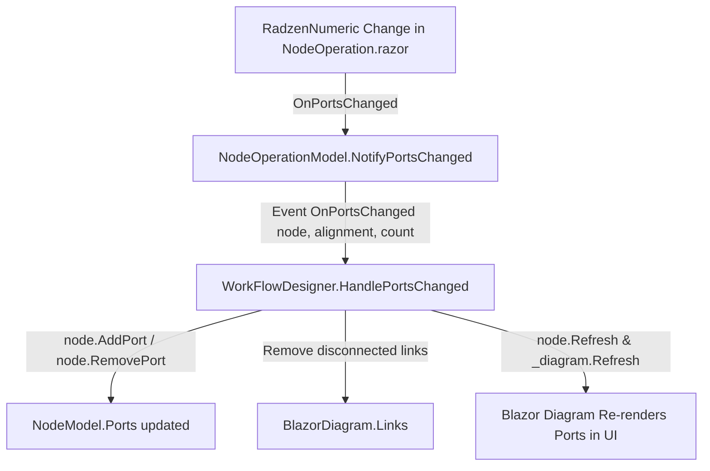

# Requirements

### Overview & Goals
Al modificar el número de puertos de entrada (*In Ports*) o salida (*Out Ports*) en la interfaz de usuario de un nodo operativo (`NodeOperation.razor`), la UI del diseñador de flujos de trabajo no actualiza los puertos visuales ni las conexiones en el diagrama cuando el flujo se carga desde una definición existente. El objetivo es restaurar y asegurar la sincronización correcta entre el control numérico de puertos, la colección interna de puertos del nodo (`NodeModel.Ports`), y el renderizado visual de `BlazorDiagram`.

### Scope
- **In Scope:**
  - Análisis del flujo de ejecución al cambiar puertos mediante `OnPortsChanged`.
  - Corrección del manejo de eventos en `Horizonte.WorkFlows/NodeModels/NodeOperationModel.cs`.
  - Corrección de la suscripción/desuscripción y manejo de eventos en `Horizonte.WorkFlows/Widgets/WorkFlowDesigner.razor` (métodos `LoadWorkFlow`, `HandlePortsChangedDelegate`, `CleanEventHandlers` y `AddNode`).
  - Sincronización del estado y renderizado visual en `NodeOperation.razor` y `WorkFlowDesigner.razor`.
- **Out Scope:**
  - Modificación de tipos de nodos distintos a nodos operativos (`NodeInModel`, `NodeOutModel`).
  - Cambios en el motor de ejecución de flujos de trabajo backend.

# Technical Design

### Causa Raíz del Problema

Al analizar el flujo de ejecución:
1. En `NodeOperation.razor`:
   ```csharp
   private async void OnPortsChanged(PortAlignment alignment, int count)
   {
       Node.NotifyPortsChanged(alignment, count);
       await InvokeAsync(StateHasChanged);
   }
   ```
   `OnPortsChanged` invoca `Node.NotifyPortsChanged(alignment, count)`, el cual dispara el evento `OnPortsChanged` en `NodeOperationModel`.
   
2. En `WorkFlowDesigner.razor`, al **cargar un flujo** (`LoadWorkFlow`):
   ```csharp
   var opModel = new NodeOperationModel(nodeDef);
   opModel.OnPortsChanged += HandlePortsChangedDelegate;
   nodeModel = opModel;
   ```
   Sin embargo, el delegado asignado `HandlePortsChangedDelegate` está vacío:
   ```csharp
   private void HandlePortsChangedDelegate(PortAlignment alignment, int count)
   {
       // Esta implementación necesita saber qué nodo disparó el evento.
       // Debido a que el evento OnPortsChanged actual no pasa el remitente...
   }
   ```
   Como resultado, al cambiar el número de puertos en cualquier nodo de un flujo cargado, **no se ejecuta `HandlePortsChanged(node, alignment, count)`**, por lo que:
   - No se agregan ni quitan puertos de `node.Ports` (`AddPort` / `RemovePort`).
   - No se recalculan dimensiones ni se invoca `node.Refresh()` ni `_diagram.Refresh()`.
   - La UI no muestra ningún cambio en los puertos.

3. En `WorkFlowDesigner.razor`, al **crear un nodo nuevo** (`AddNode`), sí se conecta una lambda anónima:
   ```csharp
   opModel.OnPortsChanged += (alignment, count) => HandlePortsChanged(opModel, alignment, count);
   ```
   Pero para flujos cargados (`LoadWorkFlow`) o al gestionar el ciclo de vida de los handlers (`CleanEventHandlers`), la suscripción estaba rota.

---

### Key Decisions & Proposed Changes

1. **Actualizar `NodeOperationModel` para incluir el remitente en el evento:**
   - Cambiar la firma a:
     ```csharp
     public event Action<NodeOperationModel, PortAlignment, int>? OnPortsChanged;
     ```
   - Actualizar `NotifyPortsChanged`:
     ```csharp
     public void NotifyPortsChanged(PortAlignment alignment, int count)
     {
         OnPortsChanged?.Invoke(this, alignment, count);
     }
     ```

2. **Actualizar `WorkFlowDesigner.razor`:**
   - Implementar el manejador común:
     ```csharp
     private void HandlePortsChanged(NodeOperationModel node, PortAlignment alignment, int count)
     {
         // Lógica existente de ajuste de puertos, remoción de links huérfanos y refresco del diagrama
     }
     ```
   - En `LoadWorkFlow` y `AddNode`, suscribir `opModel.OnPortsChanged += HandlePortsChanged;`.
   - En `CleanEventHandlers`, desuscribir limpiamente `opModel.OnPortsChanged -= HandlePortsChanged;`.

3. **Garantizar el refresco y cálculo de dimensiones:**
   - Mantener el ciclo de actualización con `node.Refresh()`, `StateHasChanged()`, reseteo de `port.Initialized = false`, `port.Refresh()` y `_diagram.Refresh()`.

### Architecture Diagram



### File Structure & Changes
- `Horizonte.WorkFlows/NodeModels/NodeOperationModel.cs`: Actualizar firma de `OnPortsChanged` y llamada a `NotifyPortsChanged`.
- `Horizonte.WorkFlows/Widgets/WorkFlowDesigner.razor`: Unificar `HandlePortsChanged`, suscribir en `LoadWorkFlow` y `AddNode`, desuscribir en `CleanEventHandlers`.

# Testing

### Validation Approach
- Comprobar que al modificar los campos `In Ports` y `Out Ports` en el modo de diseño (`DesignerMode.Design`) en un flujo de trabajo existente:
  1. Aumentar el número de puertos añade nuevos puertos visualmente en el nodo correspondiente en las posiciones relativas correctas.
  2. Disminuir el número de puertos elimina los puertos sobrantes y elimina cualquier enlace/conexión que estuviera conectado a los puertos eliminados.
  3. No se producen fugas de memoria o suscripciones duplicadas al recargar o cambiar de flujo de trabajo.
- Comprobar que tanto nodos creados dinámicamente (`AddNode`) como nodos cargados desde JSON/definición (`LoadWorkFlow`) reaccionan inmediatamente al cambio numérico de puertos.

# Delivery Steps

### ✓ Step 1: Refactorizar evento OnPortsChanged en NodeOperationModel
Implementar la propagación adecuada del nodo emisor en el evento `OnPortsChanged` para permitir la suscripción y desuscripción limpia.
- Modificar la firma del evento en `Horizonte.WorkFlows/NodeModels/NodeOperationModel.cs`: `public event Action<NodeOperationModel, PortAlignment, int>? OnPortsChanged;` (o mantener compatibilidad pasando la instancia del nodo).
- Actualizar el método `NotifyPortsChanged(PortAlignment alignment, int count)` para invocar `OnPortsChanged?.Invoke(this, alignment, count);`.

### ✓ Step 2: Corregir suscripción y desuscripción de eventos en WorkFlowDesigner
Conectar el manejador real `HandlePortsChanged` al cargar flujos de trabajo en `WorkFlowDesigner.razor`.
- Actualizar `LoadWorkFlow` para suscribir cada `NodeOperationModel` a un manejador que invoque `HandlePortsChanged(opModel, alignment, count)`.
- Actualizar el método `CleanEventHandlers` para desuscribir correctamente los manejadores de eventos asociados a los nodos del diagrama al limpiar o destruirse el componente.
- Homogeneizar la suscripción de `AddNode` para usar el mismo esquema limpio.

### ✓ Step 3: Verificar y sincronizar ciclo de actualización de UI
Validar el ciclo de renderizado en `NodeOperation.razor` y `WorkFlowDesigner.razor`.
- Asegurar que al cambiar los valores en los `RadzenNumeric` de `NodeOperation.razor`, se invoque `NotifyPortsChanged` y tanto el modelo de puertos como las dimensiones y el diagrama Blazor Diagram se sincronicen y refresquen visualmente.
- Verificar que la adición y eliminación de puertos y enlaces asociados funcione correctamente en flujos cargados y en nodos nuevos.